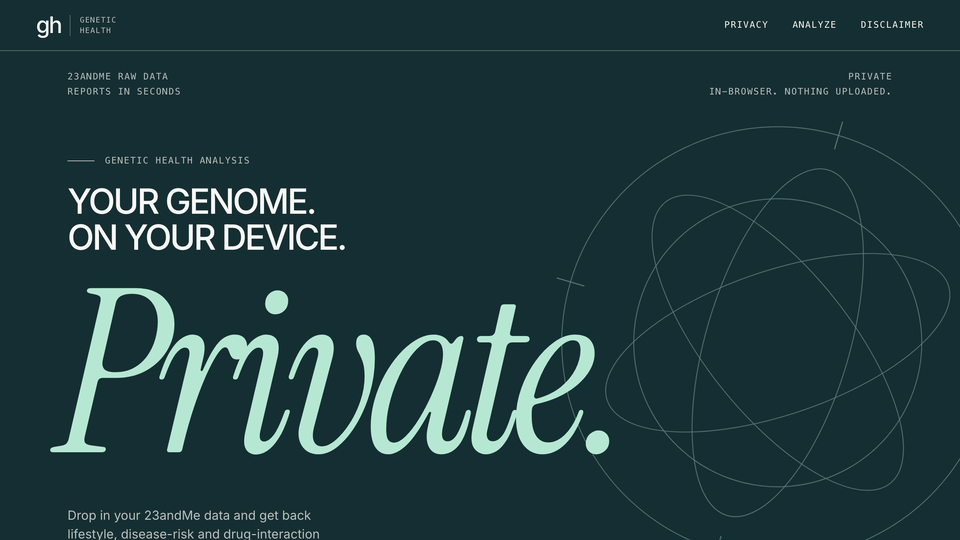

# 🧬 Genetic Health Analysis

So I had a 23andMe file just sitting in my downloads folder doing absolutely nothing, so I built this. It reads your raw 23andMe export and spits out an actual health report — drug metabolism, methylation, nutrition, fitness, cardiovascular stuff, plus whatever ClinVar and PharmGKB have on file about your specific variants.

**Do yourself a favor and pair this with an LLM.** Like, seriously, don't just skim the raw report and close the tab. Dump it into ChatGPT or Claude and talk to it like it's your own personal doctor who has actually read your DNA — ask it what YOU specifically should do about YOUR specific genome. That's honestly the whole point. The report is the raw material; the LLM conversation is where it gets useful. I've got some copy-paste prompts for this further down.



*Demo of the web app running locally in the browser.*

Two ways to run it:

| | |
|---|---|
| 🌐 **Web app** | Lives in your browser: [ashton-dias.github.io/genetic-health-analysis](https://ashton-dias.github.io/genetic-health-analysis/). Your genome file never gets uploaded anywhere — it all happens on your machine. |
| 🖥️ **CLI (Python)** | Same brain, runs locally, spits reports out onto disk. |

---

## What it spits out

- **Exhaustive Genetic Report** — lifestyle & health stuff: drug metabolism, methylation, nutrition, fitness, sleep, cardiovascular, plus PharmGKB drug-gene interactions
- **Exhaustive Disease Risk Report** — ClinVar pathogenic variants, carrier status, risk factors, protective variants
- **Actionable Health Protocol** — all of the above mashed into supplement, diet, exercise, and monitoring recommendations you can actually follow

## Quick start

### Web app

```bash
cd web
npm install
npm run dev
```

Drop a `genome.txt` file in and you'll have all three reports a few seconds later. Check [`web/README.md`](web/README.md) if you want to build it and put it somewhere online (Vercel, Netlify, GitHub Pages, Cloudflare Pages — all free, take your pick).

### CLI

```bash
python scripts/run_full_analysis.py                 # uses data/genome.txt
python scripts/run_full_analysis.py path/to/genome.txt --name "Jane Doe"
```

Reports land in `reports/`. [`CLAUDE.md`](CLAUDE.md) has the full rundown on the pipeline if you want to poke around.

## 💡 Okay, seriously, use an LLM for this

These reports are dense on purpose — that's kind of the tradeoff for being thorough. So don't just read it raw. Grab the downloaded `.md` file and paste it into ChatGPT, Claude, whatever you've got, and talk it through like it's a doctor who specializes in exactly you. Some prompts worth stealing:

- **Simplify it**: "Read this genetic health report and rewrite it in plain English. Group findings into three buckets: 'no action needed,' 'worth discussing with my doctor,' and 'safe to act on now.' Skip repeating the disclaimers — I've already read them."
- **30-day action plan**: "Based on this report, build a prioritized 30-day action plan. Pick the 3-5 changes (supplements, diet, exercise, monitoring) that will have the biggest impact, order them by how soon I should start each one, and explain why each one made the cut."
- **Doctor visit prep**: "I'm bringing this report to my next doctor's appointment. Turn it into a short list of specific questions to ask and tests to request, ordered by how urgent each one is."
- **One-week meal plan**: "Turn the dietary recommendations in this report into a realistic one-week meal plan with a grocery list, sized for one person."
- **Supplement safety check**: "List every supplement this report recommends, with dose and reason. Flag any that commonly interact with each other or with common medications, so I know exactly what to double-check with a pharmacist."
- **Explain the science**: "Pick the 3 highest-impact findings in this report and explain the underlying biology for each one like I'm smart but have no medical background."

*(The web app has these same prompts baked in with copy buttons, right after your reports pop up, so you don't even have to come back here.)*

> ⚠️ **One catch**: uploading a report to a cloud LLM sends that file to a third party — unlike your raw genome, which never leaves your device anywhere in this project. Only do this with a service you actually trust, or run a local model (Ollama, LM Studio) if you want that same on-device guarantee for this step too.

## 🔒 Privacy

The web app reads your genome file with the browser's File API and never sends it anywhere — the only network calls it makes are for its own bundled reference data (ClinVar, curated SNP stuff), which is public anyway. Don't just trust me on this — pop open your browser's Network tab while it's running and watch for yourself. Nothing genome-shaped goes out.

## Data sources

- **ClinVar** ([NCBI](https://ftp.ncbi.nlm.nih.gov/pub/clinvar/), public domain) — comes bundled in this repo
- **PharmGKB** ([pharmgkb.org](https://www.pharmgkb.org/downloads), CC-BY-SA with redistribution conditions) — *not* bundled, their license is stricter about that; grab your own copy into `data/` if you want the drug-interaction findings (see [`web/README.md`](web/README.md))

## ⚠️ Disclaimer

This is for messing around and learning, not a clinical diagnosis. Genetic stuff is probabilistic, not a life sentence — a "risk factor" doesn't mean you're doomed and a "protective" variant doesn't mean you're bulletproof. Don't make actual medical decisions off this without talking to a real doctor or genetic counselor first.
